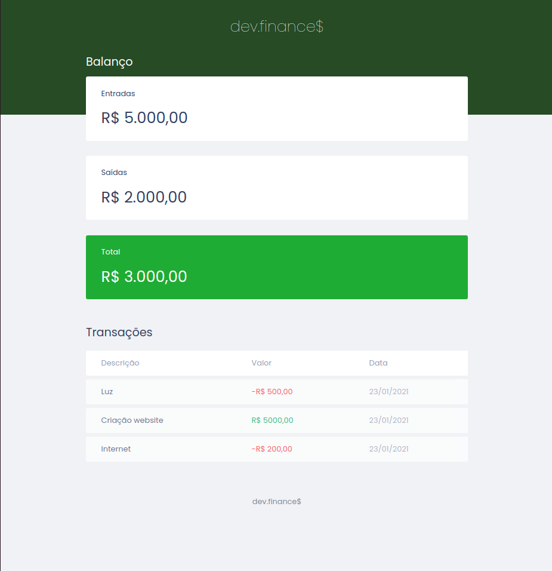

---

  

  
   
  

  <a href="#-information_source-sobre-a-aula">Sobre</a> •
  <a href="#-open_file_folder-aulas">Aulas</a> • 
  <a href="#-woman_office_worker-autora">Autora</a> • 
  <a href="#-pencil-licença">Licença</a>

 

# ℹ️ Sobre a aula

### Estrutura da aplicação com HTML e estilização inicial com CSS.

 

# 📂 Conteúdo
 

## 📚 Apresentação
 

 

## 📚 Tarefa 02: Assistir aos cursos/aulas
 

### 📌 Revisão
* HTML
  - [O guia estelar de HTML](https://app.rocketseat.com.br/node/o-guia-estelar-de-html)
    - [Exercício](./exercicio)
  - [HTML que faz sentido para todos](https://app.rocketseat.com.br/node/html-que-faz-sentido-para-todos)
   

* CSS
  - [O guia estelar de CSS](https://app.rocketseat.com.br/node/o-guia-estelar-de-css)
  - [Nem tudo são pixels](https://app.rocketseat.com.br/node/nem-tudo-sao-pixels)
  - [Uma caixa dentro da outra](https://app.rocketseat.com.br/node/uma-caixa-dentro-da-outra)
  - [App bonito até nos textos](https://app.rocketseat.com.br/node/app-bonito-ate-nos-textos)
   
  
* [Guia estelar de HTTP](https://app.rocketseat.com.br/node/guia-estelar-de-http)
  1. Entendendo
      - Visão geral
      - Visualizando a comunicação
  2. Conceitos (com exceção da aula de proxies)
  3. URI (com exceção da aula de URN)

 

### 📌 Preparação para próxima aula
 

* HTML
  - [Posso ver e ouvir o HTML](https://app.rocketseat.com.br/node/posso-ver-e-ouvir-o-html)
    - [Exemplo](./exemplo)
  - [Formulários de outro planeta](https://app.rocketseat.com.br/node/formularios-de-outro-planeta)
    - [Forms](./forms)
 

* CSS
  - [Nem só de classes ou ID's](https://app.rocketseat.com.br/node/nem-so-de-classes-ou-i-ds)
 

 

# 👩‍💼 Autora

<b>Nádia Ligia</b>

 

 

# 📝 Licença

Esse projeto está sob a licença MIT. Veja o arquivo [LICENSE](../LICENSE) para mais detalhes.
