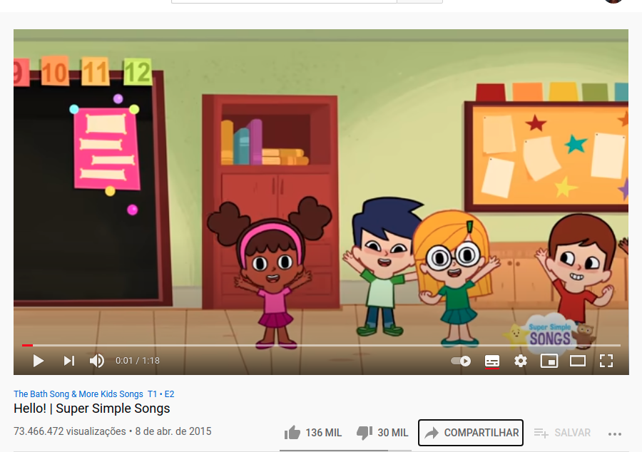
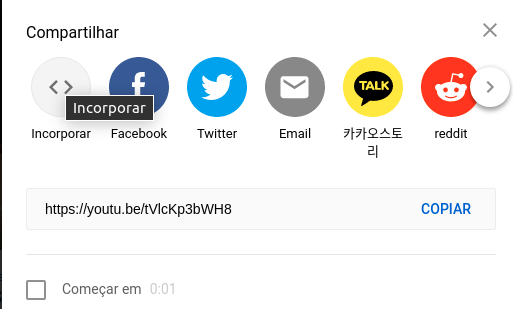
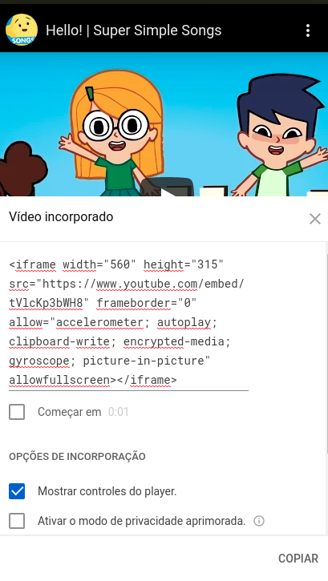
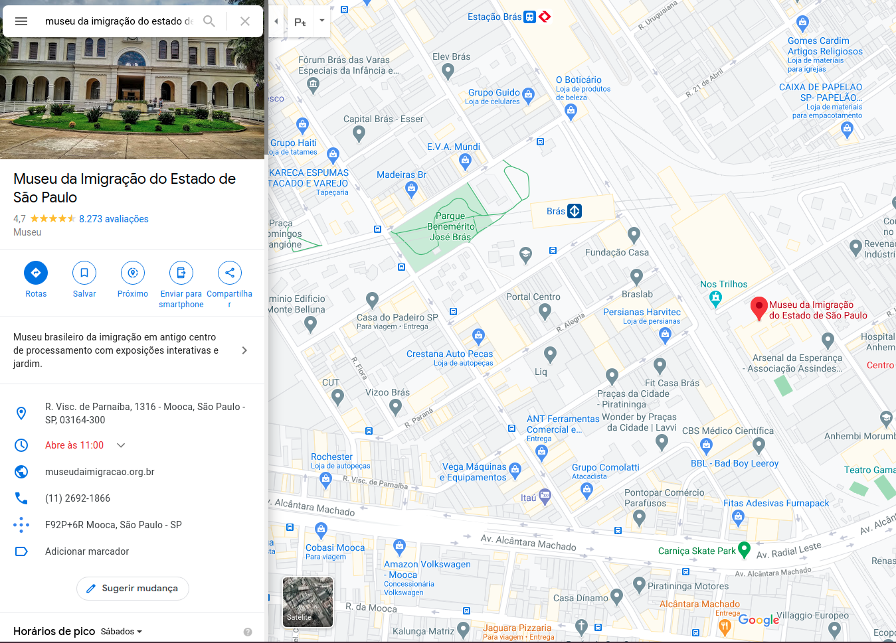
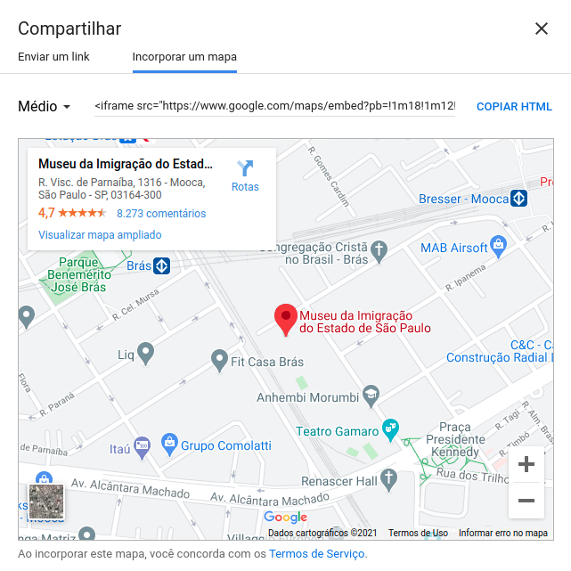

---

  

  
   
  

  <a href="#-information_source-sobre-o-exercício">Sobre</a> •
  <a href="#-open_file_folder-orientações">Orientações</a> • 
  <a href="#-woman_office_worker-autora">Autora</a> • 
  <a href="#-pencil-licença">Licença</a>

 

# ℹ️ Sobre o exercício

Exemplos de utilização de iframe, seja em videos, mapas.

 

# 📂 orientações

### 📌 Vídeos

- Quando da utilização de vídeos do youtube o iframe poderá ser incorporado através da opção `incorporar` existente no compartilhar, conforme demonstrado abaixo:

 

### 📌 Mapas

- No [google maps](https://www.google.com.br/maps/preview) utilizar a opção `compartilhar` e `Incorporar um mapa`.

# 👩‍💼 Autora

<b>Nádia Ligia</b>

 

 

# 📝 Licença

Esse projeto está sob a licença MIT. Veja o arquivo [LICENSE](../../LICENSE) para mais detalhes.
