<p align="center">
  
</p>

---

<p align="center">
  

  
   
  <a href="./license.md">
  
  </a>
</p>

<p align="center">
  <a href="#-information_source-sobre">Sobre</a> •
  <a href="#-open_file_folder-aulas">Aulas</a> • 
  <a href="#-woman_office_worker-autora">Autora</a> • 
  <a href="#-pencil-licença">Licença</a>
</p>
<br>

# ℹ️ Sobre o exercício

Conteúdo disponibilizado no item [Formulários de outro planeta](https://app.rocketseat.com.br/node/formularios-de-outro-planeta) do Módulo Discover.

<br>

# 📂 Aulas

## 📌 Estrutura
<br>

### 📚 `<form>`
- Elemento que definirá um formulário
- É um container estilo `<section>` `<footer`

Atributos básicos:
- action => pra onde esse formuário será submetido
  - quando estiver vazio, a página fará o reload.
- method => métodos para envio do formulário: `POST` ou `GET`
  - no método POST os dados não aparecem na URL e é utilizado para criação de alguma coisa.
  - o método GEST é utilizado no método GET.
- *por padrão o método é GET e a action é para a mesma página* 

**Não podemos criar um `form` dentro de outro `form`**

```html
<form action="" method="">
  ...
</form>
```
<br>

### 📚 `<fieldset>`
- agrupamento de campos
- mesmo propósito
- semântico
- acessibilidade

Atributos especiais
- `disabled`
  - desabilita todos os elementos internos
  - não serão enviados ao submeter o formulário
- `form`
  - o `id` de um formulário ao qual esse `fieldset` pertence
  - não precisa estar dentro do formulário
- `name`
  - nome do grupo

<br>

### 📚 `<legend>`
- nome do agrupamento
- primeiro elemento dentro do `fieldset`

```html
<form>
  <legend>Contato</legend>
</form>
```

### 📚 Exemplos:

- fieldset dentro do formuário

  <p align="center">
    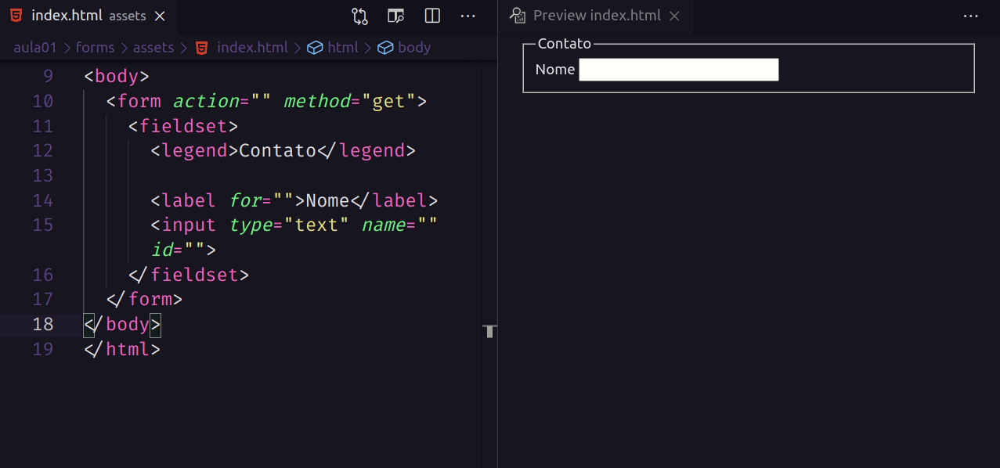
  </p>

- fieldset fora do formulário => não esquecer do id/form para fazer a correlação entre as tags.
  <p align="center">
    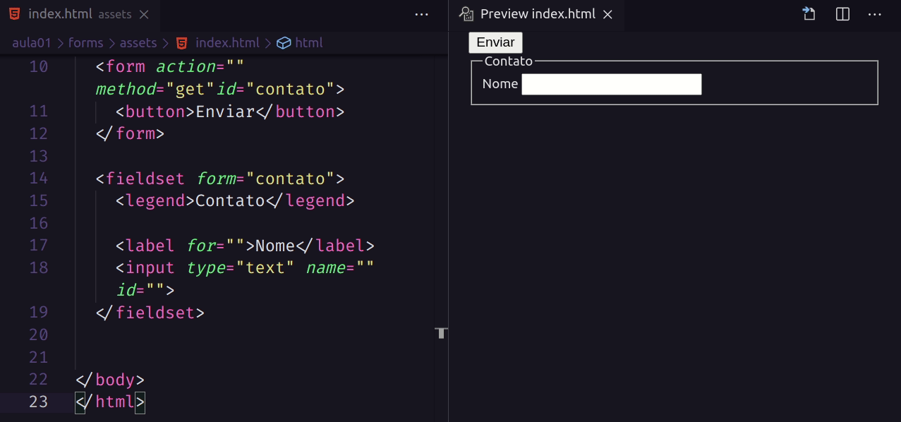
  </p>
<br>

### 📚 `<label>`
- associar e identificar uma ou mais tag de entrada de dados
- acessibilidade
- pode ser clicada para mudar o foco da entrada de Dados

Atributos
- `for`
  - para fazer a conexão entre este `label` e a tag de entrada de dodos
  - é feita via `id` do input
  - só funciona com elmentos específicos: `button`, `input` (not hidden), `meter`, `output`, `progress`, `select`, `textarea`

```html
<label for="name">Nome completo</label>
<input type="text" id="name">
```

<br>

### 📚 `<button>`
- Representa um botão
- usado para enviar Formulários
- é estilizado pelo user agent (navegador)

Atributos columns
- type
  - submit => formulário será enviado
  - reset => limpar o formuário
  - button
- autofocus
- disabled
- name
- value
- form => linkar a um formulário qualquer

```html
<button type="reset">Limpar</button>
```

<p align="center">
  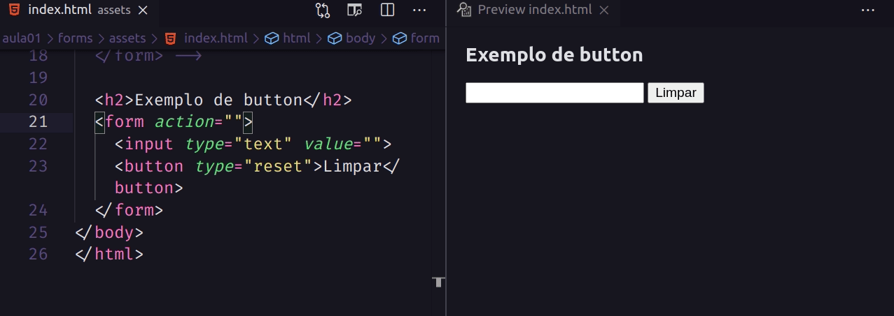
</p>
<br>

<br>

### 📚 `<datalist>`
- lista de valores como sugestão a um tag `<input>`
- valores sugestivos e não obrigatórios
- usuário poderá selecionar um dos valores, ou colocar um valor diferente da sugestão.

```html
  <datalist id="fruitsdata">
    <option value="apple">apple</option>
    <option value="banana">banana</option>
    <option value="mango">mango</option>
    <option value="orange">orange</option>
    <option value="cherry">cherry</option>
  </datalist>
```

▶️ list
  - Recebe como valor o id de um `<datalist>` residente no mesmo documento.

▶️ Tipos de input suportados
  - text, search, url, tel, email, date, month, week, time, datetime-loca, number, range e color

▶️ Valores de datalist que não são compatíveis com o tipo do `<input>` não serão apresentados.

▶️ Tipos de input nã suportados
  - hidden, password, checkbox, radio, file, ou qualquer tipo de button

▶️ User Agent
  - verificar a compatilidade com o browser - [link](https://caniuse.com)

<p align="center">
  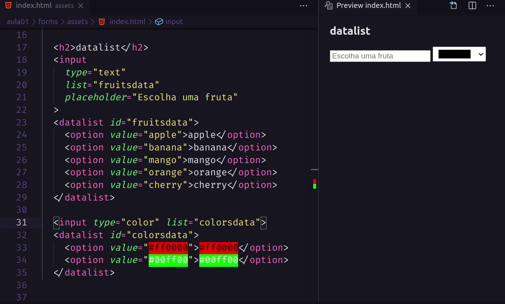
</p>

<br>

## 📌 Tag de Entrada de Dados
<br>

### 📚 `<input>`
- Um dos mais usados em Formulários
- Aceita os mais diversos tipos de dados
- Um dos mais podeosos e comnplexos
- Elevado número de combinações

Atributos
- type
- name
- id

<br>

### 📚 Input atributos
- ***autocomplete*** => buscar no navegador algum tipo de dado que já foi utilizado anteriormente com frequência.

- ***autofocus*** => no carregamento da página o cursor aparecerá no primeiro input que ele estiver habilitado. Um por paǵina.

- ***disabled*** => desabilita o input. Mesmo o valor do `value` não pode ser alterado.

- ***readonly*** => satributo booleano indicando se o campo está habilitado ou não.

- ***value*** 

- ***form*** => linkar com algum formulário

- ***name*** => importante para a utilização do `form` e no recebimento no `backend`

- ***required*** => bollean que significa que esse input é obrigatório, ou seja, não é possível enviar o formulário sem essa informação.

- ***placeholder*** => utilizado em campos específicos. Não trocar o `label` pelo `placeholder` pois haverá perca de acessibilidade.

<br>

### 📚 `<input type="password">`
- colocar uma senha de maneira segura
- esconde o que está sendo digitado no campo
- o estilo da apresentação do campo depende do User Agent

▶️ ***Atributos***
- `minlength` / `maxlength` => o número nínimo e/ou máximo de caracteres para este campo.

- `size` => o número aceitável de caracteres que esse campo deverá conter.

- `pattern` 
  - expressão regular para validar o que está sendo digitado no campo.
  - altamente recomendado o uso de um padrão de segurança alta de senhas
  - exemplo: queremos que a senha contenha caracteres hexadecimais com o limite de no mínimo 4 e no máximo 8 caracteres
    - pattern="[0-9a-fA-F]{4,8}"

<p align="center">
  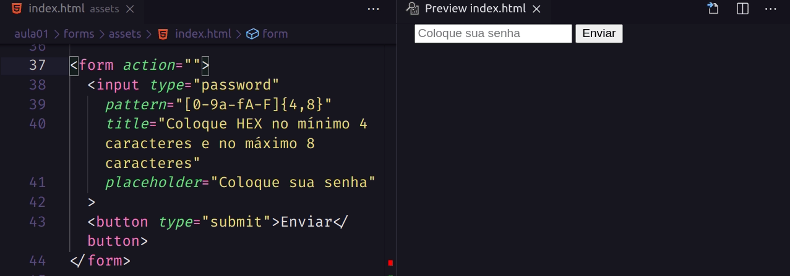
</p>

<br>

- `inputmode`
  - poderá alterar o uso do eclado em smartphones
  - exemplo: queremos que o cliente só adicione números: `inputmlode="numeric"`

- `autocomplete`
  - *on*: permite a sugestão de new-password ou current-password.
  - *off*: desabilita a opção de autocompletar
  - *new-password*: o navegador poderá sugerir uma nova senha

<br>

### 📚 `<input type="email">`
- espera que o usuário digite um Email
- irá validar se o valor digitado é um Email

▶️ Atributos
- placeholder
- readonly / disabled
- required
- minlength / maxlength
- size

- `multiple` => boolean - o campo irá receber 1 ou mais emails, separado por vírgulas

- `pattern` 
  - uso de expressão regular para validar o campo. 
  - *exemplo*: o usuário só poderá colocar email do domínio rocketseat.com.br
    - pattern=".+@rocketseat\.com\.br"

- `list`
  - o `id` de uma tag `<datalist>` que está no mesmo documento
  - `<datalist>` irá conter uma lista de valores pré-definidos a fim de sugerir ao usuário, quais valores estão disponíveis.
    - Os valores do `<datalist>` que não forem compatíveis com o campo, não serão apresentados como sugestão

```html
<input type="email" 
    placeholder="digite o email"
  >
  
  <button type="submit">Enviar</button>
```
<br>

### 📚 `<input type="url">`
- Espera que o uusário digite uma URL
- irá validar se o valor digitado é uma url

▶️ Atributos
- placeholder
- readonly / disabled
- value
- required
- minlength / maxlength
- size
- list


- `pattern`
  - uso de expressão reglar para validar o campo
  - *exemplo*: o usuário só poderá colocar domínimo `.com.br`
    - pattern=".*\.com\.br\/.*"

- `spellcheck` => habilita a verficação ortográfrica para este unput
```html
<form action="" method="get">
  <input type="url" 
    placeholder="http//example.com.br"
    pattern=".*\.com\.br.*"
    title="Somente domínios .com.br serão aceitos"
  >
  
  <button type="submit">Enviar</button>
</form>
```
<br>

### 📚 `<input type="file">`
- usuário poderá escolher 1 ou mais arquivos para enviar no formulário.

▶️ Atributos
- `value` => contém o arquivo a ser enviado

- `accept` => descreve que tipos de arquivos serão aceitos. *Exemplo*: .doc, .docx, .pdf, audio/*, image/png, .png

- `files` => a lista de arquivos

- `multiple` => permite o envio de múltiplos arquivos

▶️ Envio dos arquivos

Para envio dos arquivos o formulário deverá utilizar o método `POST` e o atributo `enctype` como `multipart/form-data`

<p align="center">
  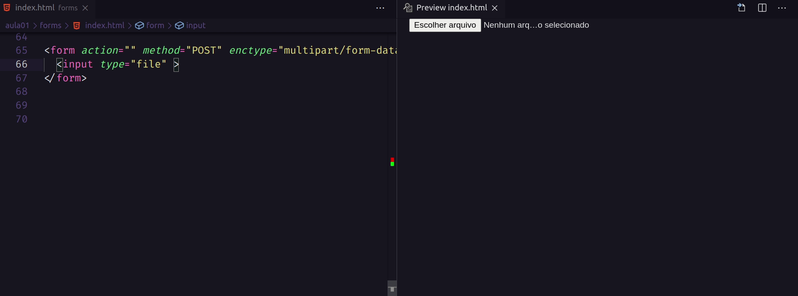
</p>

<br>

### 📚 `<input type="color">`
- interface para selecionar cor
- Color picker

▶️ atributos
- `value` => RGB => se inválido, o preto será exibido.
- `list` => não disponível para alguns browsers

<p align="center">
  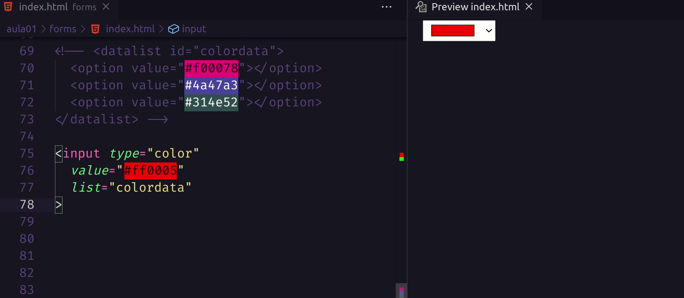
</p>

<br>

### 📚 `<input type="checkbox">`
- caixas que podem ser marcadas.
- selecionar o valor para ser enviado
- se não selecionado, não será enviado nenhum dado

▶️ Atributos
- globais
- `value` => valor que aque campo contém. Se não estiver presente, o padrão é `on`.
- `checked` => para deixar o campo marcado por padrão.

<p align="center">
  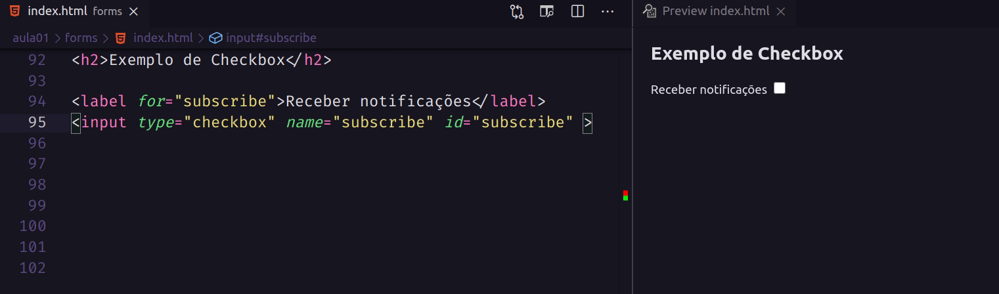
</p>

<br>

▶️ Marcar múltiplos Valores
- utilizado o atributo `name` como o mesmo nome para os diversos campos.

<p align="center">
  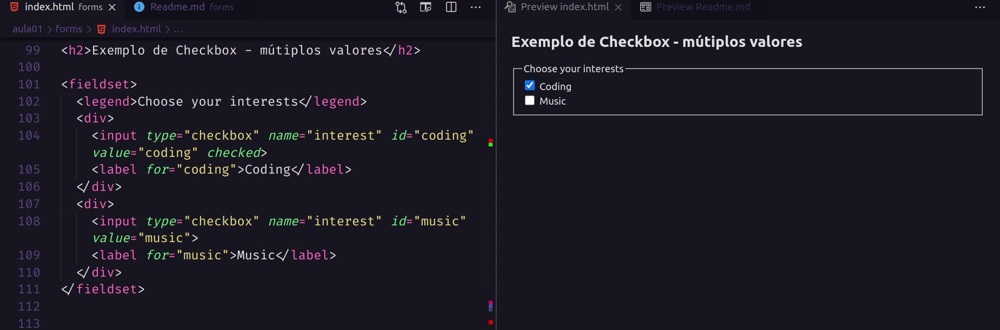
</p>

<br>
 
### 📚 `<input type="hidden">`
- invisível ao usuário
- será enviado com o formulário
- não receberá foco
- leitores de tela nã percebem esse campo

```html
<input type="hidden" name="timestamp" id="timestamp" value="1286705410">
```

<br>

### 📚 `<input type="radio">`
- projetado para selecionar uma única opção de um grupo de opções

▶️ Atributos
- `checked` => indica que o campo foi marcado
- `value` => valor que aquee campo contém

<p align="center">
  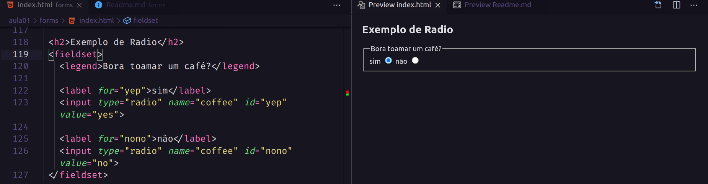
</p>

<br>

### 📚 `<input type="textarea">`
- textos de mais de uma linha
- útil para textos grandes

▶️ Atributos
- id
- name
- rows e cols
- maxlength e minlength
- `wrap` => quebra de linha. Vem de padrão `soft`
- outros comuns: autocomplete, autofocus, disabled, placeholder, readonly, form, required

```html
<label for="message">Mensagem</label><br>
<textarea id="message" name="message" cols="30" rows="10"></textarea>
```

<br>

### 📚 `<input type="select">`
- controle que fornece um menu de opções

- `<option>`
  - contém as opções a serem selecionadas
  - atributos necessários: `value`

▶️ Atributos únicos
- `multiple` => habilita múyltiplas opções
- `size`=> quando opções visíveis

<p align="center">
  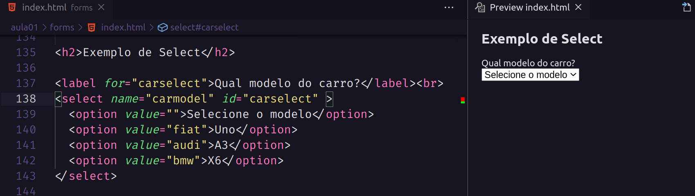
</p>

<br>

### 📚 `<input type="optgroup">`
- agrupamento dos `options` dentro do `select`
- importante utilizar o atributo label para identificação dos grupos

<p align="center">
  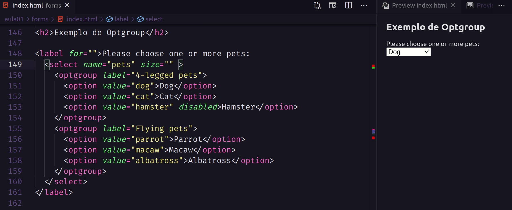
</p>

<br>

### 📚 `<input type="search">`
- para campos de busca
- é igual ao campo do tipo `text` mas poderá ser um pouco diferente dependendo do `user agente`

▶️ Atributos
- list / datalist
- pattern
- `aria-label` => opção quando não se tem o label

▶️ Exemplo com `datalist`
<p align="center">
  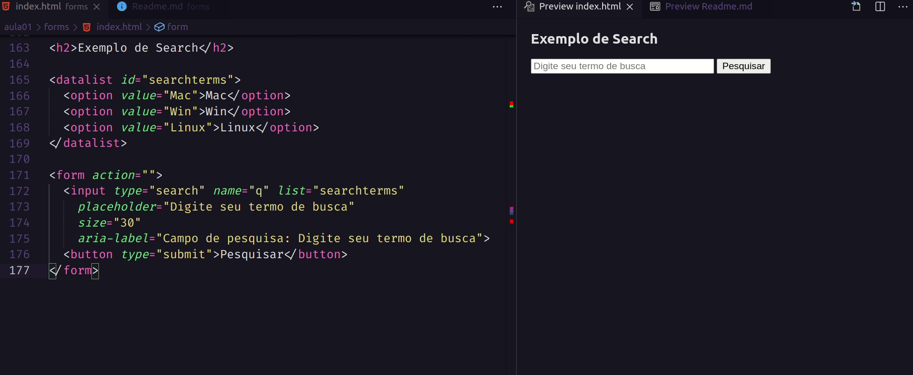
</p>

<br>

▶️ Exemplo com `pattern`
<p align="center">
  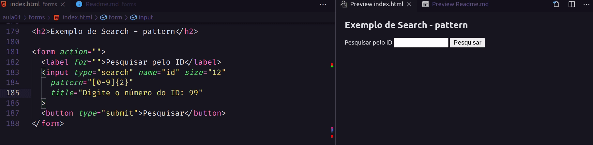
</p>

<br>

### 📚 `<input type="number">`
- entrada de números

▶️ Atributos
- `min/max` => maior e/ou menor número permitido
- `step` => de quanto em quanto será computado o número do input

```html
<form action="">
  <input type="number" min="0" max="1000" step="50">
  <button type="submit">Enviar</button>
</form>
```

### 📚 `<input type="range">`
- controle para selecionar um valor numérico
- slider ou dial controle

▶️ Atributos
- min/max
- step

<p align="center">
  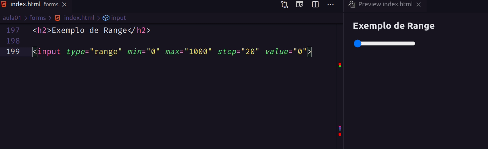
</p>

<br>

### 📚 Outros campos interessantes
- sempre verificar se há suporte para os browsers.

<p align="center">
  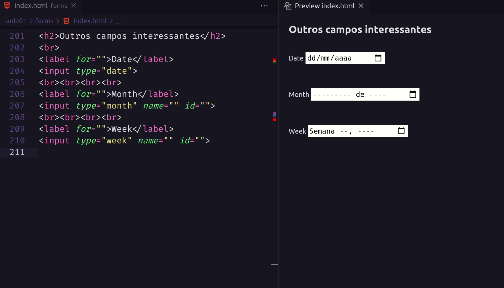
</p>

<br>

## 📌 Criando um formulário

### 📚 Desenhando
- Pensar nos requisitos
- Ajuda a definir as necessidades

▶️ **Dicas**
- simples e focado
- somente dados necessários
- verifique o que te agrada

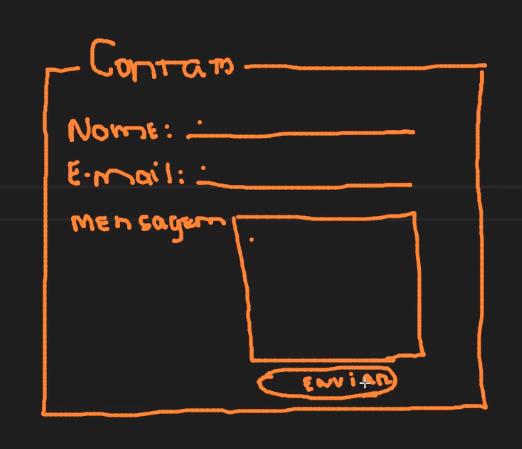

<br>

### 📚 Criação de um formulário de Contato

1. O formulário deverá conter um título de nome Contato. Usar `fieldset` e `legend` para essa finalidade.

2. O formulário conterá 3 campos: 
    - nome (input text)
    - email (input email)
    - mensagem (textarea)

3. O formulário deverá conter um botão para enviar

**Atenção:** O formulário deverá conter regras d3 acessibilidade, como o `label` para cada campo, por exemplo.

▶️ [Formulário](./form.html)

▶️ Resultado
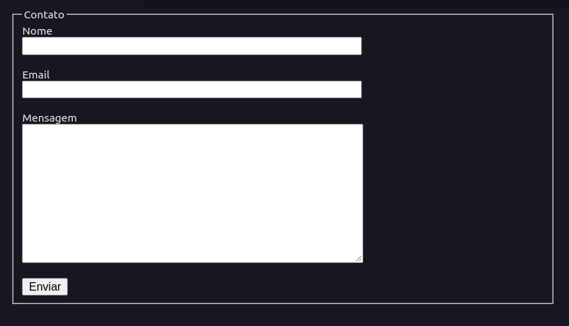

<br><br>

# 👩‍💼 Autora

<p><b>Nádia Ligia</b></p>

[](https://www.linkedin.com/in/nlnadialigia/) 
[](mailto:nlnadialigia@gmail.com)

<br>

# 📝 Licença

Esse projeto está sob a licença MIT. Veja o arquivo [LICENSE](../../LICENSE) para mais detalhes.
