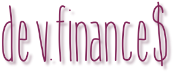
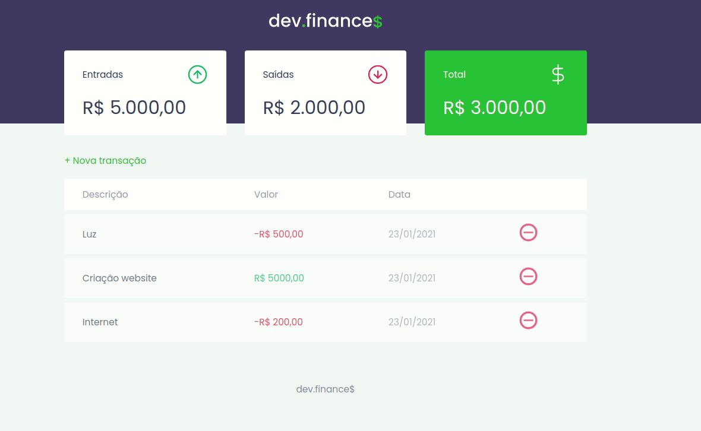

---

  

  
   
  

  <a href="#-information_source-sobre-a-aula">Sobre</a> •
  <a href="#-open_file_folder-aulas">Aulas</a> • 
  <a href="#-woman_office_worker-autora">Autora</a> • 
  <a href="#-pencil-licença">Licença</a>

 

# ℹ️ Sobre a aula

Finalização do HTML + CSS

📌 Imagens 
📌 Acessibilidade 
📌 Disposição dos elementos na página 
📌 Responsividade 
📌 Formulário para cadastro de dados 
📌 Modal 
📌 Uma pitadinha de JavaScript 

 

# 📂 Conteúdo

## 📚 Apresentação
 

 

## 📚 Tarefa 03: Assistir aos cursos/aulas
 

### 📌 Revisão
* HTML
  - [Posso ver e ouvir o HTML](https://app.rocketseat.com.br/node/posso-ver-e-ouvir-o-html)
    - [Exemplo](../aula01/exemplo)
  - [Formulários de outro planeta](https://app.rocketseat.com.br/node/formularios-de-outro-planeta)
    - [Forms](../aula01/forms)
* CSS
    - [Nem só de classes ou ID's](https://app.rocketseat.com.br/node/nem-so-de-classes-ou-i-ds)
      - [Css](../aula01/css)
### Para acompanhar a próxima aula
* [O guia estelar de JavaScript](https://app.rocketseat.com.br/node/o-guia-estelar-de-java-script)
  - [javascript](./javascript)
 

# 👩‍💼 Autora

<b>Nádia Ligia</b>

 

 

# 📝 Licença

Esse projeto está sob a licença MIT. Veja o arquivo [LICENSE](../LICENSE) para mais detalhes.