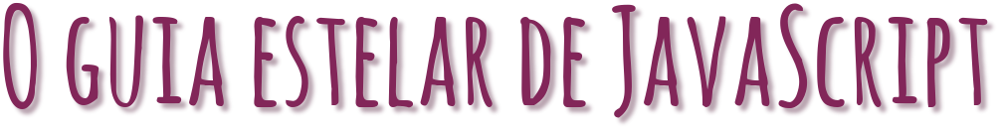

  

---

  

  
   
  

  <a href="#-information_source-sobre">Sobre</a> •
  <a href="#-open_file_folder-aulas">Aulas</a> • 
  <a href="#-woman_office_worker-autora">Autora</a> • 
  <a href="#-pencil-licença">Licença</a>

 

# ℹ️ Sobre

Módulo da plataforma Discover, com os fundamento do javascript.

 

# 📂 Aulas

## 📌 Introdução

- Linguagem de programação que roda no navegador do usuário (front-end) ou no computador (back-end).

- Pode-se criar aplicações para web, mobile, desktop utilizando javascript.

 

## 📌 Tipos de dados

### 📚 String

- Cadeia de caracteres
- `""` => aspas duplas
- `''` => aspas simples
- `` => template literals ou template strings
 

### 📚 Number

- inteiros => 33
- reais - float => 12.5
- NaN => Not a Number
- Infinity => infinitivo

 

### 📚 Boolean

- somente 2 valores:
  - `true` => verdadeiro
  - `false` => falso

 

### 📚 Undefined vs null

**undefined** => indefinido, não existe

**null** => nulo
- objeto que não possui nada dentro
- diferente de indefinido

 

### 📚 Object

- Objeto
- Propriedades / Atributos
- Funcionalidades / Métodos

{propriedade: "valor"}

 

### 📚 Array

- uma lista
- agrupamento de dado

["Mayk", 36]

 

## 📌 Variáveis

## 📌 Praticando e avançando

## 📌 Funções

## 📌 Manipulando dados

## 📌 Expressões e Operadores

## 📌 Condicionais e controle de fluxo

## 📌 Estruturas de repetição

## 📌 Consolidando com exercícios

  

# 👩‍💼 Autora

<b>Nádia Ligia</b>

 

 

# 📝 Licença

Esse projeto está sob a licença MIT. Veja o arquivo [LICENSE](../../LICENSE) para mais detalhes.
