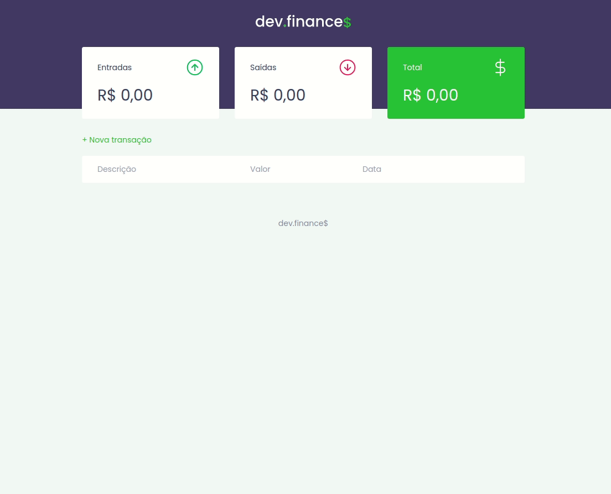

<p align="center"></p>
<h2 align="center">Aula 03</h2>

---
<p align="center">
  

  
   
  <a href="./license.md">
  
  </a>
</p>

---

<p align="center">
  <a href="#-information_source-sobre-a-aula">Sobre</a> •
  <a href="#-open_file_folder-conteúdo">Conteúdo</a> • 
  <a href="#-woman_office_worker-autora">Autora</a> • 
  <a href="#-pencil-licença">Licença</a>
</p>
<br>

# ℹ️ Sobre a aula

Javascript

📌 Objetos<br>
📌 Tipos e estrutura de dados<br>
📌 If/else<br>
📌 Erros<br>
📌 Funcionalidades<br>
📌 Adicionar e remover transações<br>
📌 Calcular<br>
📌 Salvar no localStorage<br>

<br>

# 📂 Conteúdo

## 📚 Apresentação
<br>
<p align="center">

</p>
<br>

## 📚 Pontos interessantes

Na criação das funcionalidades do formulário, cada funcionalidade será criada separadamente e depois incluída no `submit(event)`.
```js
  submit(event) {
    event.preventDefault();

    try {
      // verificar se todas as informações foram preenchidas
      Form.validateField();
      // formatar os dados para salvar
      const transaction = Form.formatValues();
      // salvar
      Transaction.add(transaction);
      // limpar os dados do formulário
      Form.clearFields();
      // fechar o modal
      Modal.close();
      // atualizar a aplicação => está incluso no Transaction.add 
      
    } catch (error) {
      alert(error.message);
    }
  }
};
```
<br>

## 📚 Tarefa 03: Assistir aos cursos/aulas
<br>

### 📌 Revisão
* [O guia estelar de JavaScript](https://app.rocketseat.com.br/node/o-guia-estelar-de-java-script)

### 📌 Assistir
- [O guia estelar de Git](https://app.rocketseat.com.br/node/o-guia-estelar-de-git)
- [O guia estelar de GitHub](https://app.rocketseat.com.br/node/o-guia-estelar-de-git-hub)
- [Pilotando com a DOM](https://app.rocketseat.com.br/node/pilotando-com-a-dom)
<br>

# 👩‍💼 Autora

<p><b>Nádia Ligia, desenvolvedora back-end em formação.</b></p>

<a href="https://www.linkedin.com/in/nlnadialigia/">
  
</a>&nbsp;
<a href="mailto:nlnadialigia@gmail.com">
  
</a>&nbsp;
<a href="https://www.nlnadialigia.com">
  
</a>

<br><br>

# 📝 Licença

Esse projeto está sob a licença MIT. Veja o arquivo [LICENSE](../LICENSE) para mais detalhes.